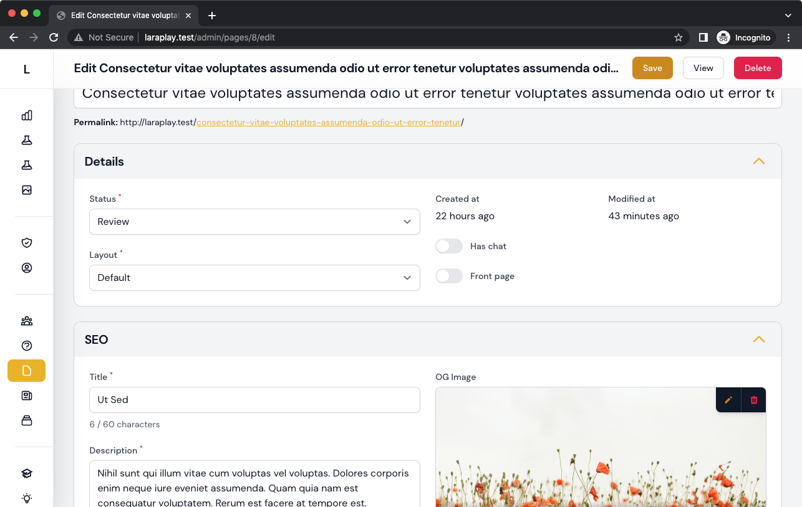
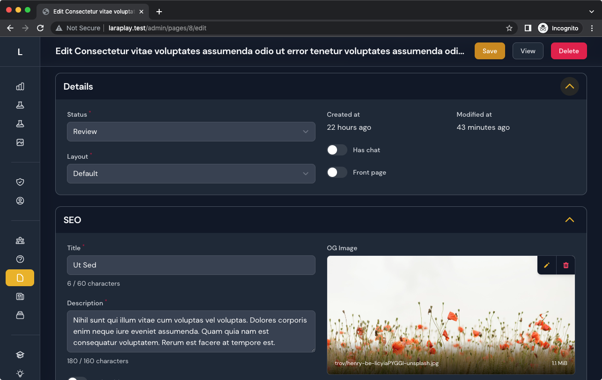

## Filament Sticky Header

:bangbang: Does not work in Safari < v16.

A Filament Admin plugin to make headers sticky when scrolling.

## Installation

Install packages via composer

```bash
composer require awcodes/filament-sticky-header
```




